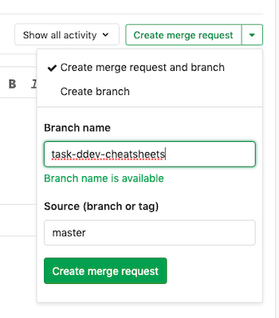
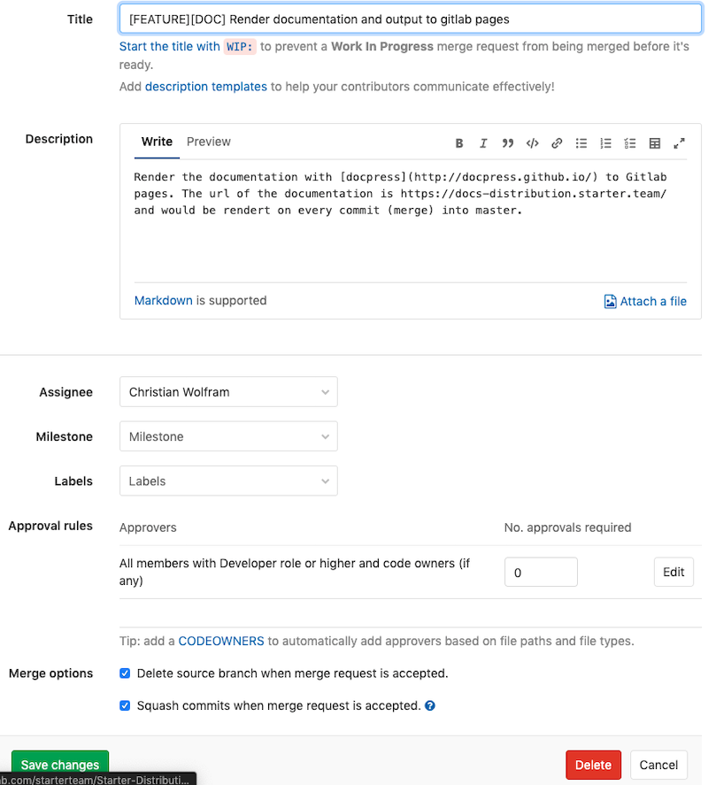

# Mitarbeit an der Dokumentation

Jeder ist an der Mitarbeiter zur Dokumentation eingeladen. Die Dokumentation befindet sich im Verzeichnis
_documenation/doc_ und kann dort mittels Markdown bearbeitet werden. Am einfachsten ist die Bearbeitung auf dem
lokalen Rechner mittels PhpStorm, Sublime oder jedem anderen Editor mit Markdown Unterstützung.

## Download des Repositories

> `git clone git@gitlab.com:starterteam/Starter-Distribution.git`

## Änderungen vornehmen

Um die Dokumentation zu erweitern/verbessern, ist es für alle am Besten wenn ein entsprechendes Ticket für eine Änderung
erstellt wird. Das Ticket sollte das Tag _documentation_ erhalten.

Nachdem das Ticket erstellt ist, kann sofort in Gitlab ein _MergeRequest_ gestellt werden, auch wenn man selbst
noch keine Änderungen vorgenommen hat. In dem Branchnamen (siehe Screenshot unten) dürfen keine Leer- und
Sonderzeichen sowie Umlaute enthalten sein.

Durch die Erstellung des MergeRequest wird zugleich ein entsprechender Branch (im Beispiel "task-ddev-cheatsheets")
generiert, welcher lokal ausgecheckt werden kann. In diesem Branch werden nun die Änderungen an der Dokumentation
vorgenommen und wieder in das Git-Repository gepushed.

## Änderungen prüfen lassen

Nachdem die Änderungen vorgenommen wurden, muss der MergeRequest in Gitlab jemanden für die Prüfung zugewiesen werden.
Hier ist es auch möglich die Prüfung von mehreren Personen vornehmen zu lassen und sogar zu bestimmen, wie viele Personen
den Änderungen zustimmen müssen, damit diese in den Master-Branch überführt werden können.

## Rendering und Veröffentlichung

Die Dokumentation wird, sofern die Änderungen in den Master-Branch eingeflossen sind **und** ein neuer Tag erstellt
wurde, automatisiert mittels [docpress](http://docpress.github.io/) gerendert und unter der URL

> https://docs-distribution.starter.team/

veröffentlicht.

## Optional - lokales Rendering

Optional ist es möglich die Dokumentation lokal generieren zu lassen, um seine Änderungen vor dem Commit noch einmal
selbst zu überprüfen.

Dazu auf der Konsole (Shell) in das Projekt **und** in das Verzeichnis _.make/documentation_ wechseln. Erst in
diesem Verzeichnis den Befehl `yarn install` ausführen. Nach einer erfolgreichen Installation kann mittels
`yarn run build-doc` die Dokumentation erzeugt werden, welche sich im Verzeichnis _documentation/__docpress_
befindet.

::: { .info }
Für die Bearbeitung der Dokumentation wird **kein** Docker (bzw. DDEV) benötigt.
:::
