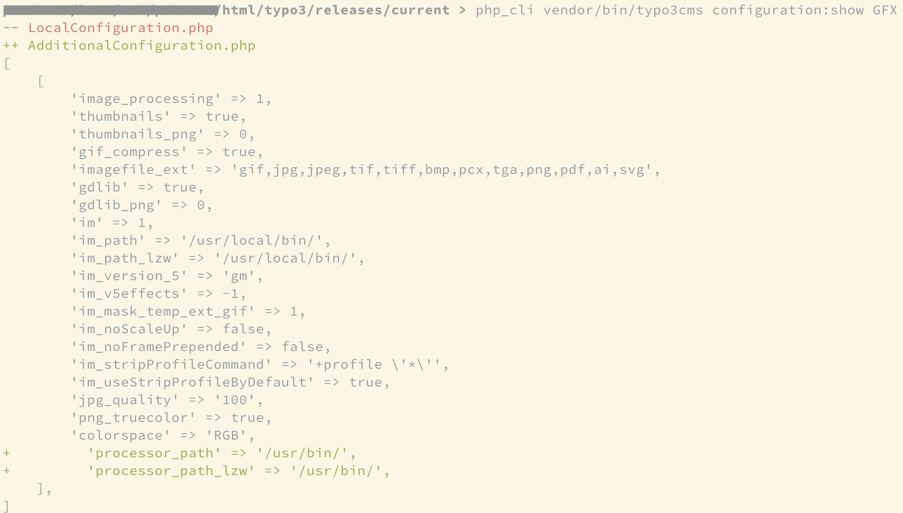

# TYPO3-Console

Die aktuelle TYPO3-Console Dokumentation ist stehts unter https://docs.typo3.org/p/helhum/typo3-console/master/en-us/
zu finden. Daher werden nicht alle Möglichkeiten/Optionen hier zusätzlich dokumentiert.

## Allgemein

Der Aufruf für die TYPO3-Console ist allgemein immer `vendor/bin/typo3cms`. Danach können ensprechende Option gesetzt
werden und der entsprechende Command angegeben werden.

::: { .info }
`PHP_VERSION vendor/bin/typo3cms [--OPTION] COMMAND`
:::

### Arbeiten im Docker-Container (lokal)

Für die Ausführung der TYPO3-Console wurde für DDEV ein ShortCut Command implementiert. Somit lässt sich die
TYPO3-Console ohne weitere Pfadangaben auf der lokalen Shell ausführen.

`ddev typo3cms [--OPTION] COMMAND`

### Umgang auf dem Hosting-Server

Auf einem Webserver kann die TYPO3-Console innerhalb des Verzeichnis "current" verwendet werden. Zudem muss vor dem
TYPO3-Console Befehl das passende PHP-Binary hinzugefügt werden. Das PHP-Binary unterscheidet sich je nach Hoster und
verwendeter PHP Version. Eine entsprechende Liste der PHP-Binaries ist im Beschreibung zum
[FAQ unter PHP Binary nach Hoster](../Faq/index.md) hinterlegt.

::: { .info }
**Beispiel für Hoster Mittwald:**

`php_cli vendor/bin/typo3cms [--OPTION] COMMAND`
:::

## Häufigsten Befehle

### Alle Befehle anzeigen

**TYPO3-Console version 4x:**

`vendor/bin/typo3cms help`

**TYPO3-Console version 5x:**

`vendor/bin/typo3cms list`

### Cache leeren

`vendor/bin/typo3cms flush:cache`

### Konfiguration anschauen

`vendor/bin/typo3cms configuration:show [PATH]`

__[PATH]__ bezieht sich hierbei auf den Konfigurationsindex in der LocalConfiguration.php.

**E-Mail Konfiguration prüfen:**

`vendor/bin/typo3cms configuration:show MAIL`

**GFX Konfiguration prüfen:**

`vendor/bin/typo3cms configuration:show GFX`

In der Ausgabe erhält man grüne und rote Zeilen, wobei die roten Zeilen Konfigurationen aus der LocalConfiguration.php
und grüne Zeilen, Konfigurationen aus der AdditionalConfiguration.php sind (siehe beispielhaften Screenshot).

### Sprachupdate durchführen

`vendor/bin/typo3cms language:update`

### Upgrade Wizard ausführen

`vendor/bin/typo3cms upgrade:all`

### Backend sperren

`vendor/bin/typo3cms backend:lock`

### Backend entsperren

`vendor/bin/typo3cms backend:unlock`

